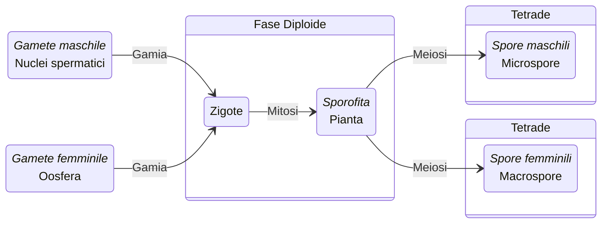
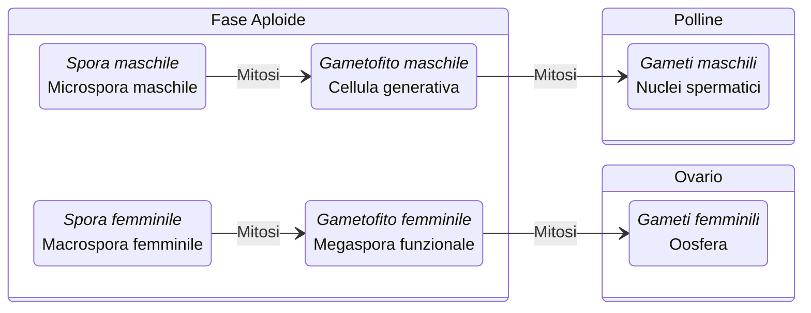

> - Sottoregno: [[Tracheofite|Tracheobionta]]
> 	- Superdivisione: [[Spermatopyhta|Spermatopyhta]]
> 		- Divisione: *Magnoliophyta*

La divisione delle *Angiosperme* è il raggruppamento di piante attualmente esistenti più numeroso, comprendendo circa 275’000 specie con un vasto spettro di caratteristiche.

##### Tassonomia
Comprendono due gruppi principali monofiletici che comprendono il 97% delle Angiosperme.
1. [[Monocotiledoni|Monocotiledoni]]
2. [[Dicotiledoni|Eudicotiledoni]]

Il restante 3% presenta caratteri arcaici che non hanno avuto successo evolutivo e sono rappresentate dai seguenti due gruppi:
- *Angiosperme basali*
- *Magnoliide*

## Caratteristiche e morfologia
Le angiosperme presentano alcune caratteristiche uniche che le differenziano da 
qualunque altro gruppo di organismi vegetali:
- Ovuli protetti in carpelli.
- Semi racchiusi in frutti.
- Microgametofito ([[Polline|Polline]]) costituito da 3 nuclei.
- Macrogametofito (*Sacco embrionale*) formato da sette cellule e otto nuclei.
- Doppia fecondazione con formazione dell’embrione 2n e dell’endosperma 3n.
- [[Legno eteroxilo|Legno eteroxilo]] composto da trachee, tracheidi, fibre e parenchima.
- [[Floema|Libro]] costituito da tubi cribosi.
- Presenza di diversi metaboliti secondari.

#### Riproduzione
- Fiori
- Ovuli protetti dall'ovario che forma il frutto
- Doppia fecondazione con formazione di endosperma
- Riduzione estrema dei gametofiti

